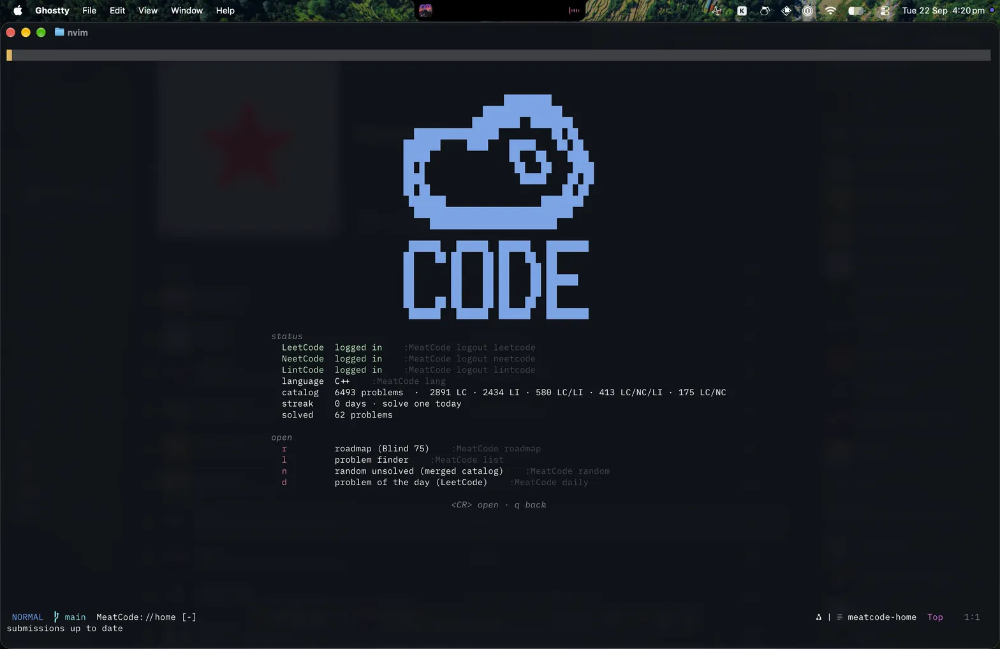

# meatcode.nvim

(L/N)eetCode without leaving Neovim. Browse problems via NeetCode's roadmap or a
fuzzy-searchable merged list of LeetCode, NeetCode, and LintCode problems. Work
on one locally, run/debug test cases locally, and submit to any of the three
providers.



Currently only C++/Python supported, feel free to submit a PR to add more
languages.

Fair warning: this repo is mostly the result of some careful LLM prompting. I
still read every issue and PR and know the codebase well enough to maintain it
for as long as I use it.

## Requirements

- Neovim 0.10+ and `curl`
- [telescope.nvim](https://github.com/nvim-telescope/telescope.nvim) for the
  LeetCode problem list
- `python3` and/or a C++ compiler, if you want local test runs
- optional: [image.nvim](https://github.com/3rd/image.nvim) to draw problem
  diagrams inline

## Install

<details open><summary>lazy.nvim</summary>

```lua
{
  "urwrstkn8mare/meatcode.nvim",
  cmd = "MeatCode",
  dependencies = {
    "nvim-telescope/telescope.nvim",
    "3rd/image.nvim", -- optional
  },
  opts = {
    lang = "python",      -- or "cpp"
    list = "neetcode150", -- blind75 | neetcode150 | neetcode250 | allNC
  },
}
```

</details>

<details><summary>packer.nvim</summary>

```lua
use {
  "urwrstkn8mare/meatcode.nvim",
  requires = { "nvim-telescope/telescope.nvim" },
  config = function() require("meatcode").setup({}) end,
}
```

</details>

Every option is listed in [doc/configuration.md](doc/configuration.md).

## Log in

Browsing and opening free problems works signed out. Submitting needs an
account with whichever provider you submit to.

| Command | What you hand over |
| --- | --- |
| `:MeatCode login leetcode` | the full `Cookie` request header from a signed-in `leetcode.com` tab (it must contain `LEETCODE_SESSION` and `csrftoken`) |
| `:MeatCode login neetcode` | NeetCode's Firebase refresh token, out of browser storage |
| `:MeatCode login lintcode` | LintCode's refresh token — a console script prints it; access tokens are minted from it as needed |

All three commands walk you through getting the value. Credentials are written with
`0600` permissions under `stdpath("cache")/meatcode` and are only ever sent to
the service they belong to. `:MeatCode logout <provider>` deletes one; `:MeatCode`
opens the homepage, which shows where you stand — press `<CR>` on a status row
there to log that provider in or out.

## Usage

| Command | What it does |
| --- | --- |
| `:MeatCode` | Open the homepage: providers, workspace, progress, and jumps |
| `:MeatCode home` | Same as above |
| `:MeatCode roadmap [name]` | Open the roadmap on `blind75`, `neetcode150`, `neetcode250`, or `allNC` |
| `:MeatCode list [query]` | Fuzzy-search the merged LeetCode/NeetCode/LintCode catalog |
| `:MeatCode random` | Open a random accessible problem you have not completed in the current language |
| `:MeatCode daily` | Open LeetCode's problem of the day |
| `:MeatCode lang [name]` | Show or change the solution language |
| `:MeatCode login`/`logout [provider]` | See above |

Anything you do to a problem is a buffer-local mapping rather than another Ex
command.

**Roadmap** — `hjkl` or arrows to move, `<CR>` to open a topic, `L`/`H` to
cycle curated lists, `?` for help, `q` to close. The terminal cursor is hidden
while the roadmap has focus since the highlighted node already shows where you
are (`ui.hide_cursor = false` keeps it).

**Problem list** — `<CR>` opens, `o` fuzzy-picks a provider/solution/video link,
`q` closes. The number beside a problem is how many days you
have completed it in the current language.

**Problem finder** — a full-page Telescope picker with the merged problem count and
your current LeetCode streak. Type to filter by number, title, slug, difficulty,
topic, or company; `<CR>` opens, `<C-o>` fuzzy-picks a link.

**Solving** — the problem opens in its own tab: statement on the left, your
solution on the right, results underneath.

| Key | Action |
| --- | --- |
| `<leader>nr` | Run the visible test cases locally |
| `<leader>ns` | Submit |
| `<leader>nt` | Edit the local test cases |
| `<leader>na` | Add the last failed submission input as a local case |
| `<leader>nR` | Reset the solution to the starter code |
| `<leader>no` | Fuzzy-pick a provider/solution/video link and open it in the browser |
| `<leader>nc` | Reorder the content/submit fallback chains (persisted as default) |
| `<CR>` or `<Tab>` | In the statement: open the hint, link, or diagram under the cursor |
| `q` | Close the problem |

## How it works

**Three providers, one problem.** Statements, tests, and starter code come from
the first provider in the content chain that has the problem and can open it;
`<leader>ns` submits to the first provider in the submit chain. Both chains are
edited with `<leader>nc` and persist as the default — there is no config option.
Paid-only problems fall through unless unlocked (any login for NeetCode/LintCode,
Premium for LeetCode). The chains configurator is the only switch; your WIP
solution is never replaced except by `<leader>nR`. The empty results panel always
lists the current keys, and `<leader>no` fuzzy-picks a link (Telescope when installed).

**Your solution is a real file on disk**, at
`stdpath("data")/meatcode/solutions/<topic>/<problem>.<ext>`, so your LSP,
treesitter, formatter and keymaps all behave normally. For C++ the plugin also
writes a `.clangd` so the language server stops flagging valid solutions; see
[doc/cpp.md](doc/cpp.md).

**Local runs need no network and no rate limit.** Expected outputs are kept
server-side, but NeetCode exposes its own *reference solution* for every
problem. So `<leader>nr` runs your code and the reference over the same inputs
and diffs them, on your machine. `<leader>ns` still goes to the cloud judge for
the hidden suite. Python and C++, function and design problems: 148/150 of the
NeetCode 150 run locally in Python, 146/150 in C++. What's covered and what
isn't, plus editing the case list, is in
[doc/local-runs.md](doc/local-runs.md).

**Completions come from your actual submission history**, not a local
checkbox. Accepted cloud submissions in the current language count once per
problem per day, and all three providers share one history, so submissions
[doc/progress.md](doc/progress.md).

**The catalog keeps itself current.** Nothing is bundled with the plugin; it is
fetched on first use and refreshed in the background at most once a day. The UI
never blocks on it, and completion history stays readable offline.

## Docs

- [Configuration](doc/configuration.md) — every option, plus highlight groups
- [Local test runs](doc/local-runs.md) — coverage, editing cases, crash output
- [C++ and clangd](doc/cpp.md) — why a `.clangd` is generated and what's in it
- [Progress tracking](doc/progress.md) — how completions and streaks are counted
- [NeetCode's API](doc/api/neetcode.md), [LeetCode's API](doc/api/leetcode.md), and [LintCode's API](doc/api/lintcode.md) — what was reverse-engineered, and how it holds up
- `:help meatcode` — the same ground in Vim help form

## Caveats

All three APIs used here are undocumented and can change without notice.
meatcode.nvim is not affiliated with or endorsed by NeetCode, LeetCode, or LintCode.
Submissions run on their infrastructure; be reasonable with them.
