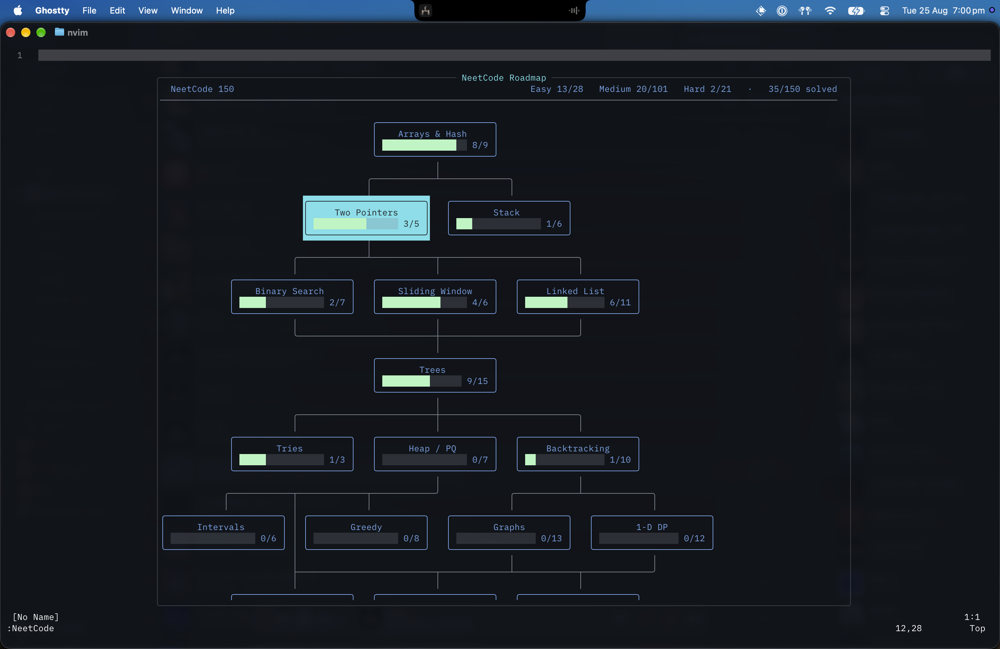

# eetCode.nvim

A TUI for the [NeetCode](https://neetcode.io) roadmap and the full
[LeetCode](https://leetcode.com/problemset/) catalog. Search every LeetCode
problem, pick a random problem or the daily challenge, solve in a real buffer,
run matching NeetCode cases locally, and submit through LeetCode by default.



This repo is the result of some careful LLM prompting. I am still happy to
respond to issues and PRs and understand the codebase enough to maintain it
until I no longer use it.

## Why local runs are possible

NeetCode keeps expected outputs server-side — the API hands you test case
*inputs* and a hidden suite count, never the answers. But it does expose its own
**reference solution** for every problem, unauthenticated.

So `run` executes your code *and* the reference solution over the same inputs and
diffs them, entirely on your machine — no rate limits, instant feedback.
`submit` uses the selected provider's cloud judge for the hidden suite.

## Install

<details open><summary>lazy.nvim</summary>

```lua
{
  "samits/eetCode.nvim",
  cmd = "EetCode",
  dependencies = {
    "nvim-telescope/telescope.nvim", -- Full-page LeetCode finder.
    -- Optional: draws problem diagrams inline.
    "3rd/image.nvim",
  },
  opts = {
    lang = "python",       -- or "cpp"
    list = "neetcode150",  -- blind75 | neetcode150 | neetcode250 | allNC
  },
}
```

</details>

<details><summary>packer.nvim</summary>

```lua
use {
  "samits/eetCode.nvim",
  requires = { "nvim-telescope/telescope.nvim" },
  config = function() require("eetcode").setup({}) end,
}
```

</details>

Requires Neovim 0.10+, `curl`, and
[Telescope](https://github.com/nvim-telescope/telescope.nvim). Local runs need
`python3` and/or a C++ compiler.

## Log in

Browsing and opening free problems works signed out. Submission and remote
progress sync require the corresponding account:

- `:EetCode login leetcode` explains how to copy the complete Cookie request
  header from a signed-in `leetcode.com` browser tab. The cookie must include
  `LEETCODE_SESSION` and `csrftoken`.
- `:EetCode login neetcode` explains how to copy NeetCode's Firebase refresh
  token from browser storage.

Credentials are stored with `0600` permissions under
`stdpath("cache")/eetcode`. They are sent only to their respective service.
Use `:EetCode logout leetcode` or `:EetCode logout neetcode` to remove one.

## Usage

| Command | What it does |
| --- | --- |
| `:EetCode` | Open the current NeetCode roadmap |
| `:EetCode roadmap [name]` | Open a roadmap; optionally select `blind75`, `neetcode150`, `neetcode250`, or `allNC` |
| `:EetCode list [query]` | Fuzzy-search every LeetCode problem |
| `:EetCode random` | Open a random accessible unsolved LeetCode problem |
| `:EetCode daily` | Open LeetCode's problem of the day |
| `:EetCode lang [name]` | Show or change the solution language |
| `:EetCode status` | Show both provider states |
| `:EetCode login [provider]` | Log in to `leetcode` or `neetcode` |
| `:EetCode logout [provider]` | Remove one provider's credentials |

Problem actions are buffer-local mappings rather than duplicate commands; see
[Solving](#solving). `L` / `H` on the roadmap also cycle its curated list.

Progress shown in both lists is the union of both accounts. Opening the roadmap
or LeetCode finder automatically refreshes provider progress, the streak, and
stale catalogs in the background; cached data keeps both views instant and
offline-safe. A LeetCode acceptance is also marked complete on NeetCode when
that account is logged in. LeetCode does not expose an API to fabricate or
remove an accepted submission, so NeetCode-only completions cannot change the
status on leetcode.com.

### Roadmap

| Key | Action |
| --- | --- |
| `h` `j` `k` `l` / arrows | Move between topics |
| `<CR>` | Open the topic's problem list |
| `L` / `H` | Next / previous curated list |
| `?` | Help |
| `q` | Close |

The terminal cursor is hidden while the roadmap has focus, since the selected
node already shows where you are. Set `ui.hide_cursor = false` to keep it.

### LeetCode finder

The full-page Telescope finder shows the problem count, current streak, and the
`random` and `daily` commands. Type to fuzzy-filter by problem number, title,
slug, or difficulty; `<CR>` opens the selected problem and `<C-o>` opens it in
a browser.

### Problem list

| Key | Action |
| --- | --- |
| `<CR>` | Open the problem |
| `<leader>nc` | Toggle solved |
| `o` | Open on LeetCode |
| `v` | Open the NeetCode video |
| `q` | Close |

### Solving

Problems opened from the roadmap, full list, random command, or daily command
use LeetCode statements, starter code, and submissions by default. If a problem
is LeetCode Premium and the signed-in user is not Premium, the matching
NeetCode problem is used instead when available. The problem opens in a new
tab: description on the left, your solution file on the right, results
underneath. The solution is a **real file on disk**, so your LSP, treesitter,
formatters and keymaps all work normally.

Solutions live at `stdpath("data")/eetcode/solutions/<topic>/<problem>.<ext>`.

| Key | Action |
| --- | --- |
| `<leader>nr` | Run the visible test cases locally when available |
| `<leader>ns` | Submit to LeetCode by default, or the active fallback provider |
| `<leader>nc` | Toggle completed |
| `<leader>nR` | Reset the solution to its provider's starter code |
| `<leader>nol` / `<leader>non` | Switch the open problem's provider |
| `<CR>` / `<Tab>` | In the statement: open the hint or diagram under the cursor |
| `q` | Close the problem |

### Diagrams

About a third of problems carry a diagram. With [`image.nvim`](https://github.com/3rd/image.nvim)
installed and a terminal that speaks the kitty graphics protocol (kitty,
Ghostty, WezTerm) they are drawn inline, with nothing but the diagram itself.
Without it, nothing breaks: a `🖼 open diagram` line takes its place, which
`<CR>` opens in your normal viewer. Disable with `ui.images = false`.

`<CR>` follows links the same way. Links in the prose show as an underlined
label with the URL hidden, and the footer carries the problem on NeetCode, on
LeetCode, and its video. Where a line holds more than one link, the column under
the cursor picks which.

### C++ and your language server

NeetCode's starter code has no `#include`s, no `using namespace std;`, and no
definition of `ListNode` / `TreeNode` / `Node` / `Interval` — its judge supplies
all of them. A language server does not, so valid solutions light up red.

So the plugin generates a `.clangd` beside your solutions (`runner.cpp.clangd`).
Compile flags — including `-std` — are taken from `runner.cpp.cmd`, so clangd
parses with the same language mode the local runner compiles with. Your
solution file is left exactly as NeetCode wrote it — nothing is inserted into
it, and nothing extra is submitted.

The generated config force-includes a shared `prelude.h` holding the standard
library and `using namespace std;`, plus a **per-problem header holding that
problem's own helper types**, lifted from the definition NeetCode leaves in its
starter comment. This matters
because there is no single right answer: `Node` is an adjacency list in Clone
Graph and a random pointer in Copy List with Random Pointer. Each problem gets
the one it actually has, so `node->random` is correctly rejected in Clone Graph
rather than silently accepted.

```text
solutions/
├── .clangd                 # one fragment per problem, PathMatch-scoped
└── .eetcode/
    ├── prelude.h           # standard library + using namespace std
    ├── clone-graph.h       # class Node { vector<Node*> neighbors; ... }
    └── meeting-schedule.h  # class Interval { int start, end; ... }
```

Headers are written when you open a problem and `.clangd` is rebuilt from
whatever exists on disk, so it stays consistent. An existing `.clangd` the
plugin did not write is left alone only if it already matches `runner.cpp.cmd`
(same `-std` / `-stdlib`); a stale or conflicting one is overwritten. Measured
over seeded solutions, `clangd --check` goes from 1–4 errors per file to zero.

**Edit test cases.** Press `<leader>nt` to edit the local suite. Add cases
separated by a line containing `---`, or delete a whole case to remove it. Use
`:w` to save and `:q` to close. Local runs also save pending edits.
`<leader>na` adds and saves the latest failed submission input, skipping
duplicates. These cases only affect local runs.

The edited suite is stored in `<solution-file>.cases`. Initially it includes the
visible cases and any legacy `.tests` extras; once saved, it replaces that combined
suite. An empty `.cases` file runs no cases. Delete it to restore the default suite.

**Legacy extra test cases.** Create `<solution-file>.tests` next to your solution and
separate cases with a line containing `---`:

```text
nums=[1,2,3,4]
target=7
---
nums=[0,0]
target=0
```

## Local runs: what's supported

Local execution covers **Python** and **C++**, for both `function` problems and
the `class` ("design") problems. Handled:

- integers, floats, booleans, `char`, strings, and nested `vector`/`list` of those
- `ListNode` and `TreeNode`, array-encoded exactly as LeetCode does — including
  `List[ListNode]` (merge-k-sorted-lists) and scalars that identify an existing
  node inside another argument (`lowestCommonAncestor`'s `p` and `q`)
- helper classes such as `Interval`, recovered from the docstring the reference
  solution carries
- in-place problems that mutate their first argument and return nothing
- 32-bit values passed as zero-padded binary strings (`reverse-bits`)
- reference solutions whose parameter names differ from the test-case keys —
  arguments are bound positionally
- design problems (Min Stack, LRU Cache, Trie, Design Twitter, ...): the call
  sequence is replayed against both your class and the reference class, and the
  two return-value lists are diffed. Both encodings NeetCode uses are decoded —
  LeetCode's two-line `names` / `args` pair, and NeetCode's interleaved
  `["MinStack", "push", 1, ...]` form, whose argument boundaries are recovered
  from the arities in the starter code
- encode/decode pairs (Serialize/Deserialize Binary Tree, Encode and Decode
  Strings), judged by round-tripping the input through both halves
- test cases that quote their numbers (`"1"` rather than `1`), coerced to the
  parameter's declared type

Not run locally: SQL, and problems that encode arguments **by reference** rather
than by value — an adjacency list in `clone-graph`, the random pointers in
`copy-linked-list-with-random-pointer`. Those cannot be faithfully rebuilt, so
the plugin says so plainly rather than reporting a bogus diff, and points you at
`submit`, which always works. C++ additionally cannot take `vector<Interval>`
(`meeting-schedule`), which Python handles.

Across the NeetCode 150 that is 148/150 runnable locally in Python and 146/150
in C++.

When your output matches the reference only up to ordering, the case is reported
as passing with a note; the real judge makes the final call.

Hard C++ crashes retain their signal number and include a diagnosis when known —
for example, `SIGSEGV` for invalid memory access and `SIGBUS` for invalid or
misaligned memory access. When LLDB is installed, the harness reruns only after
a crash and appends its source backtrace. The failing visible test case is
identified when the harness had started it.

## Configuration

```lua
require("eetcode").setup({
  list = "neetcode150",
  lang = "python",
  solutions_dir = vim.fn.stdpath("data") .. "/eetcode/solutions",
  cache_dir = vim.fn.stdpath("cache") .. "/eetcode",
  catalog_max_age = 24 * 60 * 60,   -- background refresh age; false disables refresh
  timeout = 30,
  runner = {
    python = { cmd = { "python3" } },
    cpp = { cmd = { "c++", "-std=c++23", "-g", "-O0", "-o", "{out}", "{source}" } },
    time_limit = 10,
  },
  ui = { node_width = 24, border = "rounded" },
  keys = {
    roadmap = { open = "<CR>", quit = "q", cycle_list = "L" },
    problem = {
      run = "<leader>nr", submit = "<leader>ns", complete = "<leader>nc",
      reset = "<leader>nR",
      open_leetcode = "<leader>nol", open_neetcode = "<leader>non", quit = "q",
    },
  },
})
```

## How the catalog stays current

The roadmap grouping and curated-list membership are not in any API — they live
in a static array inside the site's JS bundle. The plugin scrapes that bundle,
anchoring on a stable data string and walking outward, so it survives the
re-minification that happens on every NeetCode deploy. Results are validated
(exactly 75/150/250, expected patterns present) before replacing the cache.

Nothing is bundled with the plugin: the catalog is fetched on first use and
refreshed in the background at most once a day. The UI never blocks on it — a
cached catalog renders immediately and is swapped out when newer data lands. A
first run needs network; it takes well under a second, and the roadmap says what
it is waiting for.

See [`doc/api.md`](doc/api.md) for the full reverse-engineered API map.

## Caveats

LeetCode and NeetCode APIs used here are undocumented and can change without
notice. eetCode.nvim is not affiliated with or endorsed by either service.
Submissions execute on third-party infrastructure; use them responsibly.
